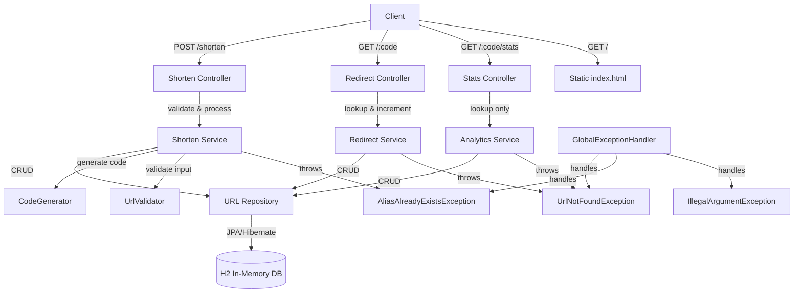

# URL Shortener

A simple URL shortener with analytics, built with Spring Boot, H2, and JPA.

## High-Level Design



## Prerequisites

- Java 17+
- Maven 3.9+

## Build & Run

```bash
mvn spring-boot:run
```

## API Endpoints

| Method | Path          | Description                         |
| ------ | ------------- | ----------------------------------- |
| POST   | /shorten      | Create a short URL (optional alias) |
| GET    | /{code}       | Redirect to the original URL (301)  |
| GET    | /{code}/stats | Get click count and metadata        |
| GET    | /             | Simple HTML client                  |

## Example requests

PowerShell:

```powershell
# Shorten
Invoke-RestMethod -Uri http://localhost:8080/shorten -Method Post -Body '{"url":"https://example.com"}' -ContentType "application/json"

# Stats
Invoke-RestMethod -Uri http://localhost:8080/<code>/stats -Method Get
```

cURL:

```bash
curl -X POST -H "Content-Type: application/json" -d '{"url":"https://example.com"}' http://localhost:8080/shorten
```

## Testing

```bash
mvn test
```

## Design decisions

See [WRITEUP.md](WRITEUP.md) for trade-offs, AI usage, and future improvements.

---

## What this Mermaid diagram shows

- **Client** – browser or curl talks to the controller.
- **Controller** – three endpoints delegate to the right service.
- **Services** – each has a single responsibility.
- **Repository** – single JPA interface abstracts the database.
- **H2** – the actual data store (in-memory, zero setup).
- **Utility classes** (`CodeGenerator`, `UrlValidator`) – pure logic, no dependencies.
- **Exception handling** – global handler catches custom exceptions and returns proper HTTP status codes.
- **Static HTML** – served directly by Spring Boot, bypassing the controller.

---

## Final steps before commit

```bash
mvn test
git add .
git commit -m "Add README with HLD diagram and final write-up"
git log --oneline
```
